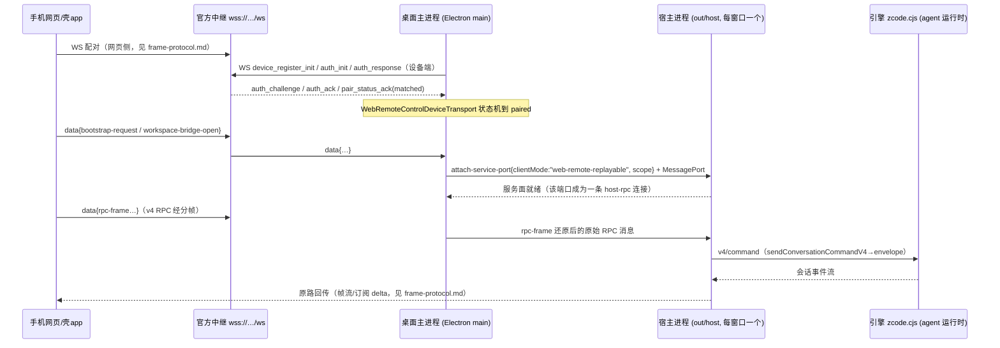

# 远程控制桌面侧架构（中继↔桌面↔引擎，源码级收口）

> 状态：2026-09-15 完成。与 [frame-protocol.md](frame-protocol.md) 分工：那份管**网页↔中继**（真机帧实证），本文管**中继↔桌面主进程↔宿主进程↔引擎**（纯源码分析，零运行时调用）。
> 对象：ZCode 桌面 3.12.1，asar（ZCode 安装目录 `resources/app.asar`）与引擎（`resources/glm/zcode.cjs`）。分析在本地抽取件上进行（asar 内路径 `out/...`，下文以 `main/index.js`、`main/chunk-HKZQKMLL.js`、`main/chunk-MCKI7TGK.js`、`host/index.js`、`host/chunk-WVGOZGGV.js` 指代）。偏移为抽取件内字节偏移（仅作分析定位记录）。压缩名→语义名标注来自产物自带的 `a(X,"名字")` 标注器，可信。
>
> 本文档为个人对已安装软件的互操作性观察笔记，仅供学习研究，与 ZCode 官方无关。

## 0. 全链路一图



关键结论先行：**远程网页客户端不是被桌面"代理执行"的二等公民，而是经主进程桥接后，与 GUI 渲染层同构的一条完整 RPC 连接（clientMode=web-remote-replayable）**；"中继"职能在桌面形态里由 Electron 主进程以 MessagePort 附件承担，`trusted-host-relay` 角色在桌面代码中确实无人构造（见 §4）。

## 1. 桌面↔中继连接（问题 1）

### 1.1 谁发起、什么协议

桌面**主进程**是 WebSocket 客户端，实现类 `ls`=WebRemoteControlDeviceTransport（`main/index.js`，偏移 353660 起的 `var ls=class{…static{i(this,"WebRemoteControlDeviceTransport")}}`），用 `ws` 包（`import{WebSocket as md}from"ws"`，index.js 偏移 353150 附近）。

- 连接地址：`new URL(this.options.relayWsUrl); t.searchParams.set("mid", this.options.deviceMid)`，请求头 `X-Device-ID: <deviceMid>`，`perMessageDeflate: true`。
- 默认地址解析（`main/chunk-HKZQKMLL.js` 偏移 566-719 与 300-320）：
  - 常量 `ht="https://zcode.z.ai"`、`hi="https://zcode.chatglm.site"`、`Uy="wss://zcode.z.ai/ws"`；
  - `Aw`=resolveWebRemoteControlRelayWsUrl：`overrideUrl ?? (endpointOrigin===chatglm.site ? "wss://zcode.chatglm.site/ws" : "wss://zcode.z.ai/ws")`；
  - `bi`=buildZCodeEndpointUrls：`relayWsUrl: wss://<host>/ws`、`remoteUrl: <origin>/remote/v3|v4`（`jy`=isWebRemoteControlV4AppVersion，≥3.4.0 走 v4）。
- 硬限：`ir.maxPhysicalFrameBytes` = `Wn.maxFrameBytes` = **1MB**（HKZQKMLL 偏移 373049：`Wn={maxFrameBytes:1024*1024,logicalFrameAssemblyMaxBytes:16*1024*1024,…}`）；单条中继消息超限直接丢弃并报 `remote.rpcFrame.envelopeTooLarge`。

### 1.2 注册/认证/配对握手（设备端帧序列，源码实证）

`connect()` → open 后按 `activeAuth.mode` 分两路（index.js 偏移 354100 附近）：

1. **首次注册**（mode="register"）：发 `{type:"device_register_init", device_mid, pass_hash, meta:{platform,version,name}, client_ts}` → 收 `device_register_ack{device_sid}` → 触发 `onRegisteredAuth({deviceSid, passHash})` 持久化 → 转认证。
2. **持久凭据认证**：发 `{type:"auth_init", role:"device", device_sid, meta, client_ts}` → 收 `auth_challenge{nonce}` → 回 `{type:"auth_response", device_sid, proof, client_ts}`，其中
   `proof = HMAC-SHA256(key=passHash, msg="${nonce}|${role}|${sid}").digest("base64url")`（`iy`=createNodeWebRemoteControlRelayAuthProvider，index.js 偏移 438900 附近：`calculateProof:(e,t,r,n)=>tM("sha256",e).update(`${t}|${r}|${n}`).digest("base64url")`）。
3. 收 `auth_ack`/`pair_status_ack{pair_status:"waiting"|"matched"}`；`matched` 即进入 `paired` 状态，可收发 `data` 帧。

### 1.3 心跳与重连（常量全表）

| 机制 | 常量 | 证据 |
| --- | --- | --- |
| 心跳 | 每 `heartbeatIntervalMs??10s` ± 20% 抖动发 `pair_status_query` | `scheduleHeartbeat`（index.js）；`n2`=getWebRemoteControlHeartbeatDelayMs（HKZQKMLL） |
| 心跳应答看门狗 | `heartbeatAckTimeoutMs??30s` 内无 pair_status_ack 即重连 | `armHeartbeatAckWatchdog`：`Date.now()-lastPairStatusAckAt` 超时 → `reconnectAfterStaleWaiting` |
| 配对后 waiting 自愈 | paired 后再收 waiting：记 `staleWaitingCount`，首次等 15s（`scheduleStaleWaitingRecovery`）再判，仍 waiting 则重连 | `applyPairStatus` |
| 断线重连 | `reconnectDelayMs??1s` + ≤2s 抖动（`o2`=getWebRemoteControlReconnectJitterMs） | `scheduleReconnect` |
| QR 就绪超时 | 30s 内未到 waiting_terminal/paired 抛 "did not reach QR-ready state" | `KD=3e4` |
| 启动授权 token | 一次性、30s 过期、绑定 windowId+workspaceKey | `qD=3e4`，`authorizeStart`/`consumeStartAuthorization` |
| 手机离线宽限 | paired 丢失后 3s 内不清 mobileConnected（防抖） | `ZD=3e3`，`scheduleMobileDisconnectGrace` |
| 出站缓冲 | 未 paired 时缓存 app 载荷，≤50 条、5s 冲洗超时后丢弃并记日志 | `bufferOutboundPayload`/`schedulePendingOutboundPayloadTimeout` |

### 1.4 中继 error 帧的桌面侧处理（`handleRelayError`）

- `KICKED` → warn 日志 + 关闭重连（不终止运行时）；
- `AUTH_FAILED` 且持久凭据且未试过 → `onInvalidPersistedAuth()` 清存储，**复用同一 passHash** 转 register 模式重注册一次（`invalidPersistedRetryUsed` 防循环）→ 拿新 deviceSid，旧 URL 的 sid 失效；
- `INTERNAL` → 已配对/等终端时转 `waiting_terminal` 继续心跳等桌面侧恢复，否则可恢复错误；
- `WRONG_PARAM` → 上报错误；其余 → 终态 error。

### 1.5 passHash/deviceSid 完整生命周期

- 生成（`iy`=createNodeWebRemoteControlRelayAuthProvider，index.js）：
  - `createPassword: randomBytes(24).toString("base64url")`；
  - **`createPassHash: sha256(password).digest("base64")`**。
  - **注意**：sha1 前 16 hex（`HD`=createMessageHashFromRaw/`zD`=createMessageHashFromText）只是 `logRelayTrace` 里中继消息的**内容指纹**（日志排障用），不是配对凭据。二维码 URL 的 `hash` 参数 = 完整 sha256-base64 passHash（`JH`=buildWebRemoteControlExternalQrUrl，HKZQKMLL 偏移 471220 附近：`searchParams.set("sid",deviceSid).set("hash",passHash).set("t",String(timestamp)).set("mid",…).set("name",…).set("app_version",…)`，`timestamp:Date.now()` 仅写入，全库无任何校验读取——URL 长期复用结论不变）。
- 存储（`sy`=createWebRemoteControlRelayAuthStorageProvider，index.js 偏移 439500 附近）：
  - deviceSid → setting.json `webRemoteControlExternalRelayDevice.deviceSid`；
  - passHash → 凭据服务键 `"web-remote-control:external-relay:pass_hash"`（源码常量 `hd`）；
  - 半缺失（只有 sid 或只有 hash）→ 双清重新注册；`rotate` = 清+存；日志只打 `deviceSidSuffix`（后 6 位）与 has* 布尔。
- 生命周期总结：首开生成 password→hash→注册换 sid→双存；AUTH_FAILED 自动恢复只换 sid 不换 hash（旧 URL 失效因 sid 变）；`resetPairing`（"leaked-qr"）双清并生成全新 password（全新 URL）。

## 2. remote.rpcFrame 可靠传输层（桌面侧实现）

实现类 `se`=AcknowledgedRelayProtocol（工厂 `ye`=createAcknowledgedWebRemoteControlRelayProtocol，`main/chunk-MCKI7TGK.js` 全文 16KB 已本地化精读）。这是主进程↔手机页面之间在 `data` 载荷里跑的**可靠有序字节流**：把上层（宿主 RPC 端口）的每条消息切成 1MB 内的 `rpc-frame`，对端用 `rpc-frame-ack` 累积确认。

- 帧格式与校验（HKZQKMLL，偏移 485577-490800）：`rpc-frame{bridgeSessionId,bridgeGeneration?,recoveryId?,seq,messageSeq,fragmentIndex,fragmentCount,messageBytes,checksum{crc32,8hex},dataBase64}`，crc32（IEEE 反射多项式）+ 规范 base64 校验；分帧数自动二分求预算，上限 64 片/16MB 消息/30s 组装超时。
- 组装器 `mh`=WebRemoteControlRpcTransportAssembler：严格序（物理序/消息序/片序任何 gap 即终态故障）、重复帧指纹比对（同指纹回 ack，异指纹 `conflictingDuplicate` 终态）、checksum 不符终态。
- 出站缓冲与降级（MCKI7TGK 常量 `c`）：

| 参数 | 值 | 超限故障码 |
| --- | --- | --- |
| 未确认缓冲上限 | 8MB | `remote.rpcFrame.replayBufferExceeded`（终态降级） |
| 重放/确认宽限 | 45s（`replayBufferGraceMs`） | `remote.rpcFrame.replayGraceExceeded` / `ackGraceExceeded`（终态）——README 所记「断线后 RPC 帧重放超时降级」的准确出处 |
| 饱和水位 | 高 1MB / 低 256KB | 触发 `onSaturated`/`onDrained`（见 §5 流控） |
| 每帧上限 | 1MB（外层中继消息同为 1MB） | `envelopeTooLarge` |

- 重连重放：桌面重新 paired 时 `onSendReady` → `lt()`（冲洗出站缓冲）+ `replayUnacknowledged()`（`resetReplay` 后重发全部未确认批）——手机断线期间桌面产生的帧在 45s/8MB 内可重放补齐，超过即桥降级（向手机发 `bridge-degraded{reason:"rpc-transport-fault"}`）。
- payload 序列化 `ge`=WebRemoteControlRelayPayloadSerializer：`{type:"data",payload,client_ts}` JSON，超 1MB 判 oversize 丢弃。

## 3. 主进程运行时与 app 载荷面（管理器 `oy`=createWebRemoteControlManager）

`main/index.js` 偏移 434300-438900。每窗口一个运行时（Map windowId→runtime），状态机 `status`: starting→running/active→error；`mapTransportState`（`Vk`）把传输状态映射到运行时：

- `paired` → `active`+mobileConnected=true，配对结果埋点（initial/reconnect）；
- `kicked` → 运行时终态失败 `Fr(windowId,…,"external-relay-kicked",createFailure("session-conflict","Web remote control connection was kicked by relay."))`（§6 详述）；
- 上层 app 载荷路由 `zk`=routePayload 按 `zcode_type` 分发（union schema 在 HKZQKMLL `rR`/`pq`=parseWebRemoteControlAppPayload）：
  - `bootstrap-request` → 桌面自组 `bootstrap-response`：`{windowControlSessionId, workspaces[], tasks[], initialViewState, mobileViewState}`（workspaces/tasks 来自渲染层经 IPC `SyncWebRemoteControlWorkspaces`/`SyncWebRemoteControlTasks` 同步来的快照，**不是**实时订阅——列表变更由签名比对 `F`/`D`=buildWorkspaceListPushSignature 触发 `workspace-list-updated` 推送）；
  - `workspace-bridge-open` → 建 bridge（§4）；
  - `platform-request` → 仅 7 个白名单方法（`yp` 枚举：isDockerAvailable、listWSLDistros、listDockerContainers、listSSHConfigAliases、loadMcpFromUserDirectory、saveMcpToUserDirectory、migrateLegacyCommonMcp）；
  - `workspace-reconnect-request` → 经 IPC 让**渲染层**重连该工作区（120s 超时，`dy`=reconnectWebRemoteControlWorkspaceInRenderer）；
  - `rpc-frame`/`rpc-frame-ack` → 交 bridge 的 AcknowledgedRelayProtocol；
  - `mobile-view-state-update`/`mobile-diagnostic` → 记录/记日志（手机端上报的诊断会进桌面日志，`ya`=logMobileDiagnostic）。
- 失败原因枚举 `hp`（11 值，HKZQKMLL）：`session-not-found / session-expired / session-conflict / workspace-closed / desktop-disconnected / invalid-mobile-connection / desktop-bootstrap-timeout / connection-recovery-timeout / relay-unavailable / unsupported-action / unexpected-error`；桌面侧桥失败映射 `JD`=mapWorkspaceBridgeFailureReason：`DESKTOP_HOST_MISSING→desktop-disconnected`、`REMOTE_SESSION_MISSING|REMOTE_SESSION_WINDOW_MISMATCH→workspace-closed`、`REMOTE_WORKSPACE_IDENTITY_MISSING|MISMATCH→unsupported-action`。
- 工作区可选目标：`gd`=isBridgeableRemoteTarget——remote 工作区必须有 workspaceIdentity+remoteSessionId（即已连上的 SSH/WSL/Docker 远程会话）才可被手机桥接，否则 `workspace-bridge-error`（中文错误串「目标远程工作区尚未连接，无法创建 bridge」原样进帧）。

## 4. 远端连接→宿主服务面的桥接，与 trusted-host-relay 的真实来源（问题 2）

### 4.1 桥的建立（main 侧）

`createWorkspaceBridge`（`oe`，index.js 偏移 436600 附近）：

```js
Y = await e.attachWorkspaceHost(windowId, {workspacePath, workspaceIdentity, remoteSessionId, initialTaskId, kind});
fe = new Pp(YD(Y.port));                 // 宿主 RPC 协议客户端，包 Electron MessagePort
xe = Hp({bridgeSessionId, bridgeGeneration, recoveryId, measureFrameBytes, sendFrame});  // AcknowledgedRelayProtocol
Wn = fe.onMessage(t => xe.protocol.send(t));   // 宿主 → 手机
ae = xe.protocol.onMessage(t => fe.send(t));   // 手机 → 宿主
```

`attachWorkspaceHost`（`Nv`=createWebRemoteControlSharedHostAttachments 内的 `s`，index.js 偏移 552400-553400）：

- **local 工作区**：找到该窗口的宿主进程（windowHostProcessMap），`new MessageChannel`，向宿主 postMessage `{type:"attach-service-port", attachmentId:"shared-host-attachment-N", clientMode:"web-remote-replayable", scope:{kind:"local"}}` 并转移 port2；
- **remote 工作区**：缺 remoteSessionId/workspaceIdentity 直接抛（中文错误串）；否则走 `attachRemoteWorkspaceSessionHost({...clientMode:"web-remote-replayable"})` 到远程逻辑会话的宿主，scope 为 `{kind:"remote", remoteSessionId, workspacePath, workspaceIdentity}`。

### 4.2 宿主侧：一条与 GUI 同构的 host-rpc 连接

宿主收到 attach-service-port（host/index.js 偏移 3076700 附近）→ `rd.attach({requestId, attachmentId, clientMode, scope, port})` → `rd` 的 expose 回调即 `FMt`=exposeServicesOnMessagePort（host/index.js 偏移 3064800-3066000）：

```js
function FMt(e, t, r, o = "desktop-continuous", n = {kind: "local"}, i) {
  …
  f = p ? Mpe(p, {connectionId: `host-rpc-${Nl()}`, clientMode: o}) : void 0;   // ★ 不传 role
  …
  F = c.onFlowState(z => { E || $(z) });      // 传输背压 → 连接包装层
  $ = forwardFlowState: f.setTransportFlowState(z)
}
```

**关键实证：全库唯一的连接工厂调用点就是这里**（`grep -aob "Mpe(" out__host__index.js` 仅 3065905 一处；各 chunk 均无其他调用）。`Qn` 包装层里 `n = r.role ?? "terminal-client"`——所以：

- **桌面形态下所有连接（GUI 渲染层与远程网页桥）角色都是 terminal-client**，差异只在 clientMode（`desktop-continuous` vs `web-remote-replayable`）。远程网页客户端要自己走完整 v4 握手（hello→initialize），hello 响应由包装层 `bo.helloConversationV4(){ …; return Kn(r) }` 返回**本连接的** clientMode 与 `deliveryProfile=Hn(clientMode)`（`Hn`: desktop-continuous→"continuous"，其余→"replayable"）；网页端 `av` 握手代码据此回 clientKind="web"。
- remote scope 的服务面经 `Yn.resolveScopedServices(scope)` 取远程逻辑会话的**隔离服务集**（host/index.js `rd`=Ije({resolveScope…})），local scope 共享窗口本地服务集 `xr`。

### 4.3 trusted-host-relay 的真实来源

该角色定义于 `host/chunk-WVGOZGGV.js`（偏移 60742-69534 多处门槛），但**桌面 asar 内确实没有任何构造点**——它的用途在门槛代码里自明：

1. `T`=forwardedConnection：仅 `role==="trusted-host-relay"` 的连接可以把请求里携带的下游连接身份（`ye`=readTrustedZCodeAgentV4Connection 读 `__zcodeTrustedV4Connection` 标记）**转发**给内层服务，并把 connectionId 命名空间化为 `ro`=namespaceRelayConnectionId 的 `relay:<len>:<id><len>:<id>` 形态——即「一个受信中继进程同时代表 N 条下游连接」的部署形态。
2. 包装层公开的 `setConnectionFlowStateV4` 仅 trusted-host-relay 可调（`fault.connection.flowControlForbidden`），且要求请求带可信标记（`flowControlUntrusted`）+ 该流控路由确有订阅（`fault.subscription.notOwned`）。
3. `onDynamicProcessResourceSample`/`onDynamicMcpTelemetry` 事件也仅 trusted-host-relay 连接可收。

结论：**这套宿主协议库同时编译给桌面与服务端部署**；在"真中继进程直连宿主"的部署里，中继以 trusted-host-relay 角色连宿主并转发下游客户端。桌面形态里这个职能由 Electron 主进程以 MessagePort 附件（attach-service-port）实现——主进程是同应用内可信代码，不需要（也没有）用这个角色。远程网页客户端本身是 clientMode=web-remote-replayable 的 terminal-client，**不是** trusted-host-relay。引擎侧 `grep trusted-host-relay zcode.cjs` 为 0、`web-remote-replayable` 为 3（见 §5），与该结论一致。

## 5. 远程命令通路与能力差异（问题 3）

### 5.1 通路：与 GUI 完全同一条 v4 RPC 面

手机端「发送消息/新建会话/停止」就是网页包里的同一套 v4 客户端（与 GUI 渲染层同源）：`sendConversationCommandV4({workspacePath, envelope})` → rpc-frame 分帧 → 中继 → 主进程桥 → 宿主端口 → `Mpe` 包装层（terminal-client，完整握手后放行，校验 envelope.clientId）→ 内层服务（host/index.js 偏移 1120700 附近）→ `rs(g)` 加工 → `O.request("v4/command", envelope)` → 引擎 `Lan[t.type]` 校验执行。远程会话ID（remoteSessionId）随顶层入参走，sendText 会附 `browserAmbientContext`（内层 `Vq(browserControlExecutor,…,clientMode)`）。

引擎侧对 clientMode 的感知（zcode.cjs，3 处 `web-remote-replayable`）：

- 偏移 338832：`pN=m.enum(["desktop-continuous","web-remote-replayable"])`，browser-execute 命令 schema 带 clientMode；
- 偏移 360699：`gN` 同枚举，工作区对象 `Hi` 旁的运行时 schema；
- 偏移 487882：任务所有者命令 `promote_task_command`/`cancel_task_command` 的 `clientMode:m.literal("web-remote-replayable")`——**web 远程客户端发的命令走「先入队后晋升」的可重放语义**：断线期间命令以 `enqueue_task_command(send_prompt)` 落在任务所有者处，页面重连后 `promote` 才真正执行、`cancel` 可撤（schema 同见 main/chunk-HKZQKMLL.js 偏移 49900 附近）。这就是 clientMode 名字里 "replayable" 的含义，对应 deliveryProfile="replayable"。

### 5.2 能力差异 vs GUI

- **服务面几乎全量**：桥接的 MessagePort 上注册的服务清单 `S`=RemoteServiceAccess（MCKI7TGK 头部）含 40+ 服务（file/git/terminal/setting/credential/zcodeTask/zcodeAgent/zcodeSession/windowController/bots/hooks/plugins…）——远程端能做 GUI 能做的绝大多数操作（含改设置、读凭据服务、控制窗口），安全性完全依赖配对凭据与中继。
- **明确的收窄点**：① `platform-request` 仅 7 个白名单方法（§3）；② 无原生对话框/本地终端等桌面能力（hello capabilities 由连接形态决定）；③ 部分动态事件仅 desktop-continuous 连接可收（包装层 `onDynamicConversationTelemetryFact`/`onDynamicCuaPermissionObservation` 都判 `clientMode!=="desktop-continuous"` 返回 z.None）；④ 命令走可重放队列语义（§5.1）。
- 远程页与桌面 GUI 是同一个 React 应用（渲染 bundle 同源，GUI 根组件带 `initialWebRemoteControlMobileNavigationIntent`/`webRemoteControlTerminalTransportState` 等远程专有 props，styles-qZK50qqU.js 偏移 4654000 附近）——能力差异由运行形态而非另一套代码决定。

## 6. 会话互斥与流控（问题 4）

### 6.1 互斥/踢下线

- **网页↔网页**（第二页面顶第一页面）：中继发 `KICKED` error 帧。桌面设备传输收到后仅重连（`handleRelayError`）；手机端 KICKED 语义见 frame-protocol.md（session-conflict 终态）。桌面上「第二个设备接管」最终表现为重连后长期 `waiting_terminal`（等新配对）——具体中继裁决细节属中继侧，桌面代码不可见（待实证）。
- **桌面运行时侧**：传输状态进入 `kicked` 时，`Vk`=mapTransportState 触发终态失败：`Fr(windowId, runtime, "external-relay-kicked", {reason:"session-conflict", message:"Web remote control connection was kicked by relay."})`——`external-relay-kicked` 是运行时失败原因字符串，`session-conflict` 是给手机帧里的 reason 枚举值。
- 会话级失败还有 `failRemoteSession(remoteSessionId,…)`：远程逻辑会话关闭时，向所有桥接该会话的窗口推 `workspace-bridge-error{requestId:"remote-session-closed:<id>", reason,…}` 并解除桥。

### 6.2 流控三级链（setConnectionFlowStateV4 的真实意义）

1. **中继上行饱和**：手机→桌面方向的 rpc-frame 未确认字节过 1MB 高水位 → `xe.onSaturated` → 主进程 `fe.sendFlowState("saturated")` 沿 MessagePort 发给宿主（恢复时低水位 256KB 发 "drained"）；
2. **宿主传输层**：`FMt` 里 `c.onFlowState` 收到 → `f.setTransportFlowState(state)` 进包装层；
3. **包装层按路由转发给引擎**：`Qn` 闭包 `uo`=applyTransportFlowState 遍历本连接全部订阅路由，逐条调内层 `setConnectionFlowStateV4(A({…target, state}, connection))`——内层实现（host/index.js 偏移 1120924）只认 `ri(g)`=`__zcodeTrustedV4Connection` 标记（无标记抛 `fault.connection.flowControlUntrusted`），随后向引擎发 `v4/connectionFlow{connectionId, state}`。

所以流控对远程链路的意义：**把"手机收不动了"这个背压逐级传到引擎的会话流，让 turn 输出暂停而不是无限缓冲**——缓冲上限就是 §2 的 8MB 重放缓冲，超了即桥降级（`bridge-degraded`）。而「只有 trusted-host-relay 能调」是包装层对**外部客户端**的门槛（桌面里无人能触达）；宿主内部转发走的是同函数的标记通道，不受该角色限制。「trusted-host-relay 独占 setConnectionFlowStateV4」的说法应理解为这个双层语义。

## 7. BotRemoteWorkspaceRuntimePort（问题 5）

它是**宿主进程↔主进程**之间一对消息的名字（HKZQKMLL 偏移 8800-9800 枚举）：

- 宿主→主请求：`bot-remote-workspace-runtime-port-request{requestId, workspacePath, workspaceIdentity, target}`（HKZQKMLL `hT`）；
- 主→宿回执：`bot-remote-workspace-runtime-port{requestId, ok, error?}` + 转移的 MessagePort。

主进程侧实现 `xn`=createBotRemoteWorkspaceRuntimePort（index.js 偏移 544400-545100）：按 workspaceIdentity 找到窗口下可附加的远程逻辑会话，调用 `attachRemoteWorkspaceSessionHost({…, clientMode:"web-remote-replayable"})`，把该远程会话宿主的附加端口交出去。用途：**bot 运行时（botsService 场景）要操控一个远程工作区（SSH/WSL/Docker）时，宿主向主进程要一条通向该远程会话服务面的端口**——与 Web 远程控制的 workspace-bridge 共用同一套"远程逻辑会话宿主附加"机制（同一个 clientMode=web-remote-replayable），不是远程控制网页链路的组成部分，而是它的兄弟机制。

## 8. 对 zcode-remote-app 的可用性结论（问题 6）

**可直接利用：**

1. **桌面侧失败原因进了帧数据**：`app-error`/`workspace-bridge-error`/`bridge-degraded` 帧的 `reason` 是 11 值枚举（§3）、`error` 是桌面侧原始错误串（含中文诊断，如「目标远程工作区尚未连接」）。壳 app 的终态感知可直接消费 reason 枚举（session-conflict/workspace-closed/desktop-disconnected 等），比 DOM 文本锚更快更稳；但**会话内 provider 错误详情仍不在帧里**（frame-protocol.md 结论不变，错误对象只在渲染层 DOM）。
2. **工作区连接状态是现成状态源**：`workspace-list-updated` 推送（签名变更即推）的 `workspaces[]` 每项含 `connectionState: connected|disconnected|reconnecting` 与 `lastConnectionError` 字符串（HKZQKMLL `QI` schema）——「桌面 SSH 工作区掉线」这类状态 app 可从帧直读，无需探测。
3. **常量对齐**：app 的重连退避、心跳保活设计可对齐桌面侧参数（心跳 10s±20%、看门狗 30s、配对等待自愈 15s、手机离线宽限 3s、重放宽限 45s/8MB、出站缓冲 50 条/5s）——README「后台冻结心跳断」的恢复窗口设计有据可依。
4. **诊断通道**：手机端 `mobile-diagnostic` 事件会被桌面原样记入 host-log——壳 app 排障时让 WebView 上报诊断事件，事后可在桌面日志中核对。
5. **URL 复用结论加固**：`t` 参数只写不读（`JH` 只 set）；AUTH_FAILED 自动恢复只换 sid 不换 hash；`resetPairing` 才全换——与 README 失效场景一致，另注意 passHash 实为 sha256-base64（见 §1.5，不影响 app 行为）。

**利用不了/不需要：**

- trusted-host-relay 与 BotRemoteWorkspaceRuntimePort 属服务端/bot 部署形态，壳 app 无关；
- rpc-frame 层是桌面↔手机透明传输，app（WebView 壳）在页面之下，无需感知；
- platform-request 白名单是页面→桌面的通道，app 不经页面发不了。

**待实证（需真机/真页面验证，本文为纯源码分析）：**

- `workspace-list-updated` 的 `lastConnectionError` 实际取值样例（远程工作区掉线场景）；
- 第二页面顶掉第一页面后，桌面设备连接重连时的中继行为（长期 waiting 还是 KICKED）；
- 手机收 `bridge-degraded` 后页面实际表现（replayGraceExceeded 触发时的用户可见态）。

## 9. 证据速查表

| 结论 | 文件（asar 内） | 偏移/模式 |
| --- | --- | --- |
| 中继 WS 客户端类 | out/main/index.js | `grep -aob "WebRemoteControlDeviceTransport"` → ~353660 |
| 注册/认证帧序列 | out/main/index.js | `grep -aob "device_register_init\|auth_response"` |
| passHash 生成 | out/main/index.js | `grep -aob "createNodeWebRemoteControlRelayAuthProvider"`；`createPassHash` 处 |
| 凭据存储键 | out/main/index.js | `grep -aob "web-remote-control:external-relay:pass_hash"` |
| 默认中继地址 | out/main/chunk-HKZQKMLL.js | 偏移 566-719（`Uy`、`Aw`）；`grep -aob "resolveWebRemoteControlRelayWsUrl"` |
| QR URL 构造 | out/main/chunk-HKZQKMLL.js | `grep -aob "buildWebRemoteControlExternalQrUrl"` |
| rpc-frame schema/组装器 | out/main/chunk-HKZQKMLL.js | 偏移 485577-490800；`grep -aob "WebRemoteControlRpcTransportAssembler"` |
| 可靠传输/重放/水位 | out/main/chunk-MCKI7TGK.js | 全文；`grep -aob "replayGraceExceeded\|AcknowledgedRelayProtocol"` |
| 管理器/app 载荷路由 | out/main/index.js | `grep -aob "createWebRemoteControlManager\|routePayload"`；偏移 434300-438900 |
| attach-service-port（main） | out/main/index.js | 偏移 552400-553400；`grep -aob "web-remote-replayable"` → 552823 等 |
| attach-service-port（host） | out/host/index.js | 偏移 3076700；`grep -aob "AttachServicePort"` |
| 唯一连接工厂（不传 role） | out/host/index.js | `grep -aob "Mpe("` → 仅 3065905；FMt 内 |
| trusted-host-relay 门槛 | out/host/chunk-WVGOZGGV.js | 偏移 60742-69534；`grep -aob "trusted-host-relay"` |
| 流控内层实现 | out/host/index.js | `grep -aob "setConnectionFlowStateV4"` → 1120924 |
| 包装层流控转发 | out/host/chunk-WVGOZGGV.js | `grep -aob "applyTransportFlowState\|forwardFlowRoute"` |
| BotRemoteWorkspaceRuntimePort | out/main/chunk-HKZQKMLL.js + out/main/index.js | 偏移 8800-9800（枚举）；`grep -aob "createBotRemoteWorkspaceRuntimePort"` |
| 引擎 clientMode/晋升命令 | resources/glm/zcode.cjs | `grep -aob "web-remote-replayable"` → 338832/360699/487882 |
| 运行日志佐证 | 桌面端日志目录 | `grep "web-remote-control"`（state paired/connecting/dropped/KICKED 等行） |
